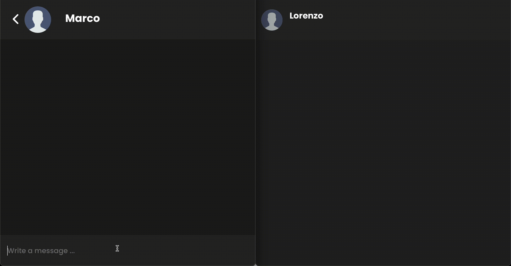
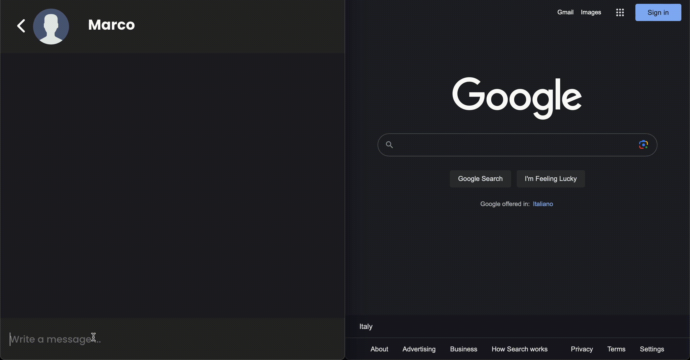

# RealTime ChatApp with end-to-end encryption

  

This project aimed to create a real-time (simplified) messaging system that uses end-to-end encryption mechanisms to ensure confidentiality and privacy of communications among users.
This project is composed of both a backend (written in Express + TypeScript) and a frontend part (written in React + TypeScript).

## Demo

### sending a message in case the recipient is online

### sending a message in case the recipient is offline

### sending a message in case of no internet connection

## Tech Stack

**Backend**:

- Express.js (web framework)
- MongoDB (used for storing users account data and friendships data )
- Redis (used for storing chat messages (and messages ack) waiting to be delivered to the recipient )
- Twilio (used for sending sms , in the process of Sign In , to the phone number specified by te user, in order to verify the phone number )

**Frontend**:

- React
- SWR (React Hooks for Data Fetching)
- Dexie.js (a wrapper for indexedDB, used for storing chat messages and other data(such as: cryptographic keys, roomId for WS connections, ecc...))
